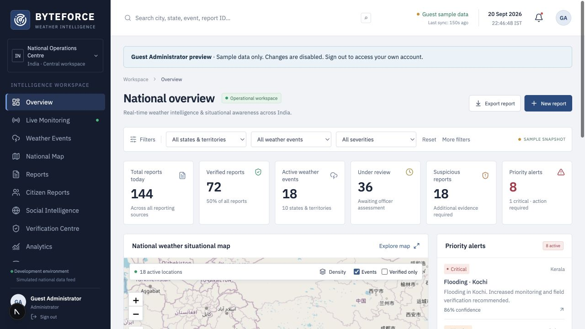
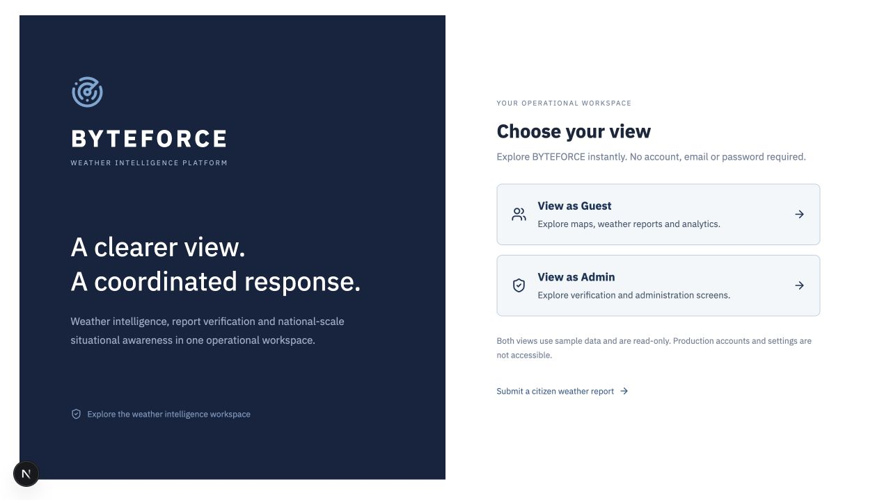
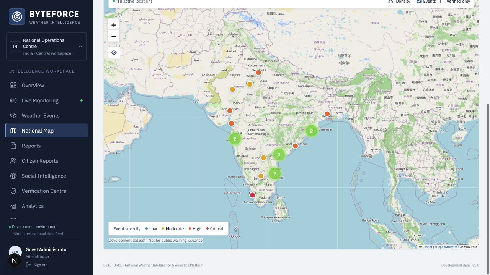
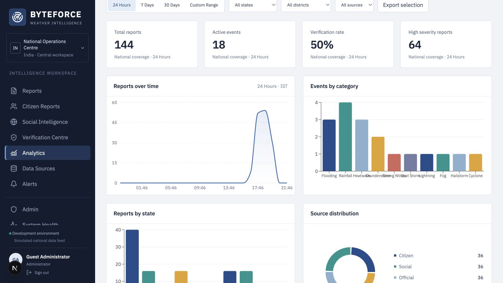
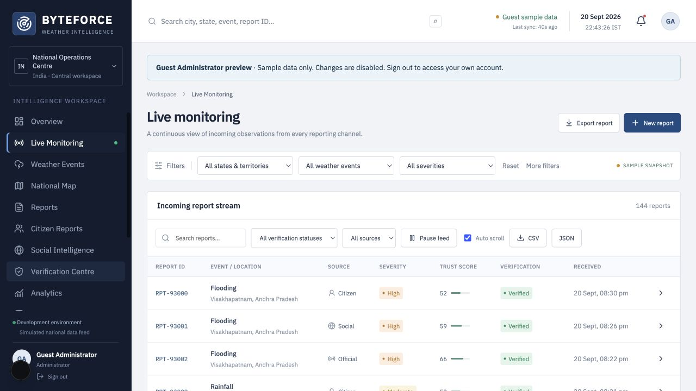
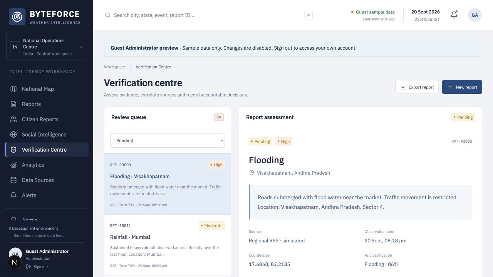
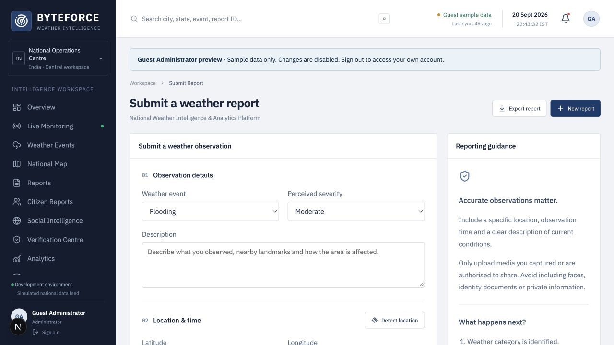
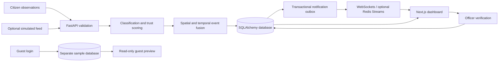

<div align="center">

# BYTEFORCE

### National Weather Intelligence & Analytics Platform

**Observe · Analyse · Verify · Respond**

A weather intelligence workspace for India: geospatial monitoring, citizen observations,
consolidated events and evidence-based verification in one application.

[UI tour](#ui-tour) · [Quick start](#quick-start) · [Architecture](#architecture) · [API](#api) · [Development guide](docs/DEVELOPMENT.md)

</div>



> **Data status:** The screenshots show the running application with isolated guest sample data. Weather observations, official-source records and social feeds in the development dataset are simulated. IMD integration is planned; no live government API connection or official warning service is claimed.

## The problem

Weather information is spread across forecasts, warnings, station observations,
rainfall products, satellite/radar products and citizen reports. Different formats
and disconnected views make geographic comparison and evidence review difficult.
BYTEFORCE brings report intake, maps, event correlation and verification into a
single workspace, with authoritative external feeds remaining a planned integration.

## What it does

| Workspace | Capabilities |
| --- | --- |
| National overview | Calculated report totals, event map, priority alerts and source distribution |
| Geospatial monitoring | Leaflet/OpenStreetMap, severity markers, clusters, report-density layer and filters |
| Event intelligence | Spatial/time-based report fusion, event dossiers, confidence, source diversity and lifecycle history |
| Citizen reporting | Location, observation time, optional contact details, anonymous submissions and image/video uploads |
| Verification centre | Evidence scoring, possible duplicates, officer decisions, reasoned rejection and audit history |
| Analytics | Time ranges, state/district summaries, source/category distributions and CSV/JSON exports |
| Operations | Alert handling, source registry, service health, user roles and configuration |
| Authentication | Email OTP through Resend, password sign-in, role checks and secure session cookies |
| Guest previews | Guest Admin and Guest Viewer, both read-only and isolated from production data |

## UI tour

Actual application screenshots captured on 20 September 2026. All names and observations shown belong to the sample workspace. Open an image to inspect it at full resolution.

### Sign-in and guest access

The original navy-and-white login supports email OTP, password sign-in and two guest previews. No email is required for a guest session.



<details>
<summary><strong>National weather map</strong> — geographic filters, severity and event clusters</summary>



The map displays report locations and consolidated events. Density indicates report concentration, not measured rainfall intensity. OpenStreetMap attribution remains visible in the application.

</details>

<details>
<summary><strong>Analytics</strong> — reporting trends and source/category comparisons</summary>



Explore 24 hours, 7 days, 30 days or a custom range. Counts reflect the selected dataset, not national coverage claims.

</details>

<details>
<summary><strong>Live monitoring interface</strong> — incoming reports and export controls</summary>



Regular authenticated sessions receive WebSocket notifications, with a polling fallback. Guest mode shows a static sample snapshot and does not subscribe to production updates.

</details>

<details>
<summary><strong>Verification centre</strong> — review queue and evidence assessment</summary>



Authorised officers can verify, flag, reject or merge reports. Guest Admin can inspect the screens, but all changes are blocked by the backend.

</details>

<details>
<summary><strong>Citizen reporting</strong> — structured ground observations</summary>



Capture an observation, attach supporting media and provide its location and time. Citizen reports remain unverified until reviewed. This application does not dispatch emergency services.

</details>

## Architecture



A report is validated, classified, scored and linked to an event. The report and notification are committed together. Officer review updates its audit trail and event confidence; connected clients then refresh their views.

**Implementation boundaries:** Classification uses deterministic rules; text deduplication uses lexical similarity. Confidence is a development heuristic, not a calibrated forecast probability. PostgreSQL/PostGIS supports indexed radius queries; SQLite uses a distance-calculation fallback. See [architecture documentation](docs/ARCHITECTURE.md).

## Technology stack

| Layer | Implemented technology |
| --- | --- |
| Frontend | Next.js 15, React 19, TypeScript |
| Interface | Custom CSS design system, Lucide icons, Radix dialog primitives |
| Maps | Leaflet, React Leaflet, OpenStreetMap, marker clustering and heat layer |
| Charts | Recharts |
| Backend | Python, FastAPI, Pydantic |
| Persistence | SQLAlchemy; SQLite for local development; PostgreSQL/PostGIS configuration |
| Authentication | JWT in HttpOnly cookies, Argon2 password hashing, Resend email OTP |
| Realtime | WebSockets, transactional outbox; optional Redis Streams |
| Packaging | Docker and Docker Compose |
| Deployment targets | Vercel frontend; Render backend and PostgreSQL |

Tailwind, trained transformer models, Kafka and Spark are not current runtime dependencies.

## Quick start

Requires **Node.js 22+**, **Python 3.12+** and npm. Run from the repository root.

```bash
cp .env.example .env
```

Edit `.env` and replace `BOOTSTRAP_PASSWORD`, `JWT_SECRET` and `OTP_HASH_SECRET` with your own strong values. Leave `DATABASE_URL` on SQLite for a setup without external database services.

```bash
./scripts/dev.sh
```

The script installs backend dependencies, installs frontend dependencies if needed, and starts both services.

- **Application:** <http://localhost:3000>
- **API documentation:** <http://localhost:8000/docs>
- **Guest preview:** select **Guest Admin** or **Guest Viewer** on the login page.
- **Initial administrator:** `admin@byteforce.local`, using the bootstrap password you configured. Bootstrap settings do not reset an existing account.

Guest previews use one-hour sessions and a separate temporary sample database. They cannot change records or expose real user accounts, uploads or realtime reports. Set `GUEST_LOGIN_ENABLED=false` on the backend to disable them.

### Email OTP

Configure these values on the backend only:

```dotenv
EMAIL_PROVIDER=resend
RESEND_API_KEY=your-private-key
EMAIL_FROM="BYTEFORCE <your-verified-sender@example.com>"
OTP_EXPIRY_MINUTES=5
OTP_RESEND_COOLDOWN_SECONDS=45
```

Set an independent `OTP_HASH_SECRET` as well. New users receive the **Viewer** role only after verifying their email. Existing users retain their roles. OTP expiry, single use, attempt limits and resend cooldown are enforced server-side. Password and guest login remain available without email delivery configuration.

See the [email setup and security details](docs/DEVELOPMENT.md#email-otp-sign-in-with-resend) for test-sender restrictions, migrations and cleanup. Never commit `.env`, private keys or database credentials.

### Docker

Set your secrets and a URL-safe `POSTGRES_PASSWORD` in `.env`, then run:

```bash
docker compose up --build
```

Compose supplies the frontend, backend, PostgreSQL/PostGIS and Redis, with persistent database and upload volumes. Its defaults target local HTTP development; production needs HTTPS and appropriate cookie/origin configuration.

## Configuration and deployment

| Setting | Where | Purpose |
| --- | --- | --- |
| `DATABASE_URL` | Backend | Persistent SQLAlchemy connection string |
| `JWT_SECRET`, `OTP_HASH_SECRET` | Backend | Independent persistent authentication secrets |
| `RESEND_API_KEY`, `EMAIL_FROM` | Backend | Email delivery credentials and sender |
| `APP_ENV=production` | Backend | Enable Secure cookies over HTTPS |
| `ALLOWED_ORIGINS` | Backend | Exact frontend origins, comma-separated |
| `GUEST_LOGIN_ENABLED` | Backend | Enable/disable isolated guest previews |
| `SIMULATE_FEED` | Backend | Enable/disable development report generation |
| `API_INTERNAL_URL` | Frontend server/build | Backend URL used by the same-origin REST proxy |
| `NEXT_PUBLIC_WS_URL` | Frontend build | Public WebSocket URL |

For the existing Vercel/Render deployment arrangement, build the frontend from `frontend/` and run the API from `backend/`. Keep database credentials and email secrets on the backend. Use **one API worker** until distributed stream fan-out is implemented. Persist uploads and configure database backups before relying on hosted storage.

Detailed manual setup, database provisioning, API examples and deployment constraints are in the [development and operations guide](docs/DEVELOPMENT.md). The screenshots document the local code; they do not certify the current hosted deployment status.

## API

FastAPI provides the full schema at `/docs`. Representative endpoints:

| Method | Endpoint | Purpose |
| --- | --- | --- |
| POST | `/api/auth/send-otp`, `/api/auth/verify-otp` | Passwordless login |
| POST | `/api/auth/login`, `/api/auth/guest` | Password or isolated guest login |
| GET / POST | `/api/auth/me` / `/api/auth/logout` | Current identity / sign out |
| GET | `/api/events`, `/api/events/{id}` | Event registry and dossier |
| GET | `/api/reports` | Report search and radius filtering |
| POST | `/api/citizen-reports` | Observation intake |
| POST | `/api/reports/{id}/verify` | Officer verification |
| GET | `/api/analytics/overview` | Calculated analytics |
| GET | `/api/sources/status` | Source registry |
| WS | `/ws` | Authenticated update notifications |

## Repository structure

```text
frontend/             Next.js routes, reusable components and domain screens
backend/app/
  api/                Authentication, accounts and event workflows
  database/           Sessions, migrations and PostGIS support
  models/             SQLAlchemy entities
  schemas/            Validated API payloads
  services/           Intake, event fusion, OTP, guest data and configuration
  ml/                 Replaceable classification module
  verification/       Evidence scoring and duplicate detection
  streaming/          WebSocket hub and notification outbox
docs/
  screenshots/        UI images used in this README
scripts/              Local startup, seeding and cleanup utilities
docker/               Application Dockerfiles
tests/                Workflow, authentication and analytics tests
```

## Validation

```bash
.venv/bin/python -m pytest tests -q
node --test tests/test_analytics.mjs
npm run build --prefix frontend
```

Coverage includes report intake, event fusion, verification, outbox delivery, OTP failures and expiry, role enforcement, guest isolation, logout and analytics date ranges. PostgreSQL concurrency and Docker deployment require checks against their target infrastructure.

## Roadmap and operational limits

- Authorised official weather providers and historical ingestion adapters.
- Licensed district boundaries and richer station-level data.
- Trained classification/embedding models and validated media evidence checks.
- Distributed consumers, independent ingestion workers and national-scale pagination.
- Managed media storage, retention policies, backups and load/security reviews.

BYTEFORCE is a working development platform with an operational-style interface. It is not affiliated with IMD or a government agency, and is not an official public-warning system.

## Project context

Developed by **Team BYTEFORCE** for **Smart India Hackathon 2026**.

| Field | Detail |
| --- | --- |
| Problem statement | SIH26069 — National Weather Big Data Analytics Platform |
| Organisation named in the problem statement | Ministry of Earth Sciences / India Meteorological Department |
| Theme | Disaster Management |
| Category | Software |
| Team ID | GITAM024 |
| Institute | GITAM (Deemed to be University), Visakhapatnam |
